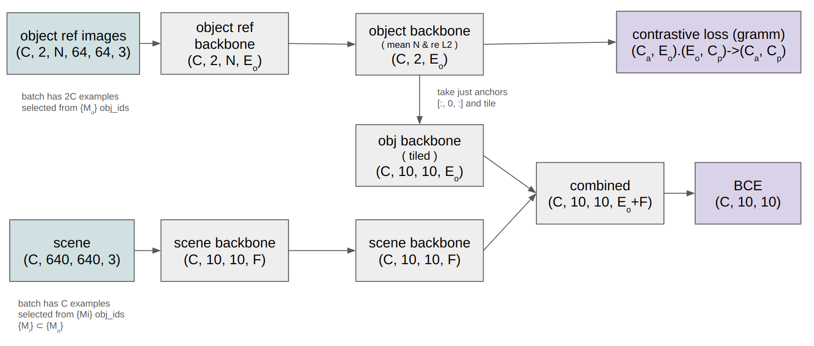

# zero shot yolo

you only look o̶n̶c̶e̶ zero times

zero shot detector that generalises to new objects by including reference images
of the object of interest as part of the model input.

see https://matpalm.com/blog/yolz for a walkthrough



## high level repro

```
sh generate_split_chunk_data.sh
sh v3_train.sh
sh v3_test.sh
```

## models

training is split across two keras models and run using `stateless_call`

### embedding

```
┏━━━━━━━━━━━━━━━━━━━━━━━━━━━━━━━━━━━━━━┳━━━━━━━━━━━━━━━━━━━━━━━━━━━━━┳━━━━━━━━━━━━━━━━━┓
┃ Layer (type)                         ┃ Output Shape                ┃         Param # ┃
┡━━━━━━━━━━━━━━━━━━━━━━━━━━━━━━━━━━━━━━╇━━━━━━━━━━━━━━━━━━━━━━━━━━━━━╇━━━━━━━━━━━━━━━━━┩
│ input_layer (InputLayer)             │ (None, 64, 64, 3)           │               0 │
├──────────────────────────────────────┼─────────────────────────────┼─────────────────┤
│ obj_e_0_conv_m (Conv2D)              │ (None, 32, 32, 16)          │             448 │
├──────────────────────────────────────┼─────────────────────────────┼─────────────────┤
│ obj_e_0_bn_m (BatchNormalization)    │ (None, 32, 32, 16)          │              64 │
├──────────────────────────────────────┼─────────────────────────────┼─────────────────┤
│ obj_e_0_relu_m (Activation)          │ (None, 32, 32, 16)          │               0 │
├──────────────────────────────────────┼─────────────────────────────┼─────────────────┤
│ obj_e_1_conv_m (Conv2D)              │ (None, 16, 16, 32)          │           4,640 │
├──────────────────────────────────────┼─────────────────────────────┼─────────────────┤
│ obj_e_1_bn_m (BatchNormalization)    │ (None, 16, 16, 32)          │             128 │
├──────────────────────────────────────┼─────────────────────────────┼─────────────────┤
│ obj_e_1_relu_m (Activation)          │ (None, 16, 16, 32)          │               0 │
├──────────────────────────────────────┼─────────────────────────────┼─────────────────┤
│ obj_e_2_conv_m (Conv2D)              │ (None, 8, 8, 64)            │          18,496 │
├──────────────────────────────────────┼─────────────────────────────┼─────────────────┤
│ obj_e_2_bn_m (BatchNormalization)    │ (None, 8, 8, 64)            │             256 │
├──────────────────────────────────────┼─────────────────────────────┼─────────────────┤
│ obj_e_2_relu_m (Activation)          │ (None, 8, 8, 64)            │               0 │
├──────────────────────────────────────┼─────────────────────────────┼─────────────────┤
│ obj_e_3_conv_m (Conv2D)              │ (None, 4, 4, 128)           │          73,856 │
├──────────────────────────────────────┼─────────────────────────────┼─────────────────┤
│ obj_e_3_bn_m (BatchNormalization)    │ (None, 4, 4, 128)           │             512 │
├──────────────────────────────────────┼─────────────────────────────┼─────────────────┤
│ obj_e_3_relu_m (Activation)          │ (None, 4, 4, 128)           │               0 │
├──────────────────────────────────────┼─────────────────────────────┼─────────────────┤
│ obj_e_gp (GlobalMaxPooling2D)        │ (None, 128)                 │               0 │
├──────────────────────────────────────┼─────────────────────────────┼─────────────────┤
│ obj_embeddings (Dense)               │ (None, 128)                 │          16,384 │
├──────────────────────────────────────┼─────────────────────────────┼─────────────────┤
│ obj_e_l2 (L2Normalisation)           │ (None, 128)                 │               0 │
└──────────────────────────────────────┴─────────────────────────────┴─────────────────┘
 Total params: 114,784 (448.38 KB)
 Trainable params: 114,304 (446.50 KB)
 Non-trainable params: 480 (1.88 KB)
```

trained contrastive loss

### scene

```
┏━━━━━━━━━━━━━━━━━━━━━━━━━━━━━━━┳━━━━━━━━━━━━━━━━━━━━━━━━━━━┳━━━━━━━━━━━━━━━━━┳━━━━━━━━━━━━━━━━━━━━━━━━━━━━┓
┃ Layer (type)                  ┃ Output Shape              ┃         Param # ┃ Connected to               ┃
┡━━━━━━━━━━━━━━━━━━━━━━━━━━━━━━━╇━━━━━━━━━━━━━━━━━━━━━━━━━━━╇━━━━━━━━━━━━━━━━━╇━━━━━━━━━━━━━━━━━━━━━━━━━━━━┩
│ scene_input (InputLayer)      │ (None, 640, 640, 3)       │               0 │ -                          │
├───────────────────────────────┼───────────────────────────┼─────────────────┼────────────────────────────┤
│ scene_0_conv_m (Conv2D)       │ (None, 320, 320, 8)       │             224 │ scene_input[0][0]          │
├───────────────────────────────┼───────────────────────────┼─────────────────┼────────────────────────────┤
│ scene_0_bn_m                  │ (None, 320, 320, 8)       │              32 │ scene_0_conv_m[0][0]       │
│ (BatchNormalization)          │                           │                 │                            │
├───────────────────────────────┼───────────────────────────┼─────────────────┼────────────────────────────┤
│ scene_0_relu_m (Activation)   │ (None, 320, 320, 8)       │               0 │ scene_0_bn_m[0][0]         │
├───────────────────────────────┼───────────────────────────┼─────────────────┼────────────────────────────┤
│ scene_1_conv_m (Conv2D)       │ (None, 160, 160, 16)      │           1,168 │ scene_0_relu_m[0][0]       │
├───────────────────────────────┼───────────────────────────┼─────────────────┼────────────────────────────┤
│ scene_1_bn_m                  │ (None, 160, 160, 16)      │              64 │ scene_1_conv_m[0][0]       │
│ (BatchNormalization)          │                           │                 │                            │
├───────────────────────────────┼───────────────────────────┼─────────────────┼────────────────────────────┤
│ scene_1_relu_m (Activation)   │ (None, 160, 160, 16)      │               0 │ scene_1_bn_m[0][0]         │
├───────────────────────────────┼───────────────────────────┼─────────────────┼────────────────────────────┤
│ scene_2_conv_m (Conv2D)       │ (None, 80, 80, 32)        │           4,640 │ scene_1_relu_m[0][0]       │
├───────────────────────────────┼───────────────────────────┼─────────────────┼────────────────────────────┤
│ scene_2_bn_m                  │ (None, 80, 80, 32)        │             128 │ scene_2_conv_m[0][0]       │
│ (BatchNormalization)          │                           │                 │                            │
├───────────────────────────────┼───────────────────────────┼─────────────────┼────────────────────────────┤
│ scene_2_relu_m (Activation)   │ (None, 80, 80, 32)        │               0 │ scene_2_bn_m[0][0]         │
├───────────────────────────────┼───────────────────────────┼─────────────────┼────────────────────────────┤
│ scene_3_conv_m (Conv2D)       │ (None, 40, 40, 64)        │          18,496 │ scene_2_relu_m[0][0]       │
├───────────────────────────────┼───────────────────────────┼─────────────────┼────────────────────────────┤
│ scene_3_bn_m                  │ (None, 40, 40, 64)        │             256 │ scene_3_conv_m[0][0]       │
│ (BatchNormalization)          │                           │                 │                            │
├───────────────────────────────┼───────────────────────────┼─────────────────┼────────────────────────────┤
│ scene_3_relu_m (Activation)   │ (None, 40, 40, 64)        │               0 │ scene_3_bn_m[0][0]         │
├───────────────────────────────┼───────────────────────────┼─────────────────┼────────────────────────────┤
│ scene_4_conv_m (Conv2D)       │ (None, 20, 20, 128)       │          73,856 │ scene_3_relu_m[0][0]       │
├───────────────────────────────┼───────────────────────────┼─────────────────┼────────────────────────────┤
│ scene_4_bn_m                  │ (None, 20, 20, 128)       │             512 │ scene_4_conv_m[0][0]       │
│ (BatchNormalization)          │                           │                 │                            │
├───────────────────────────────┼───────────────────────────┼─────────────────┼────────────────────────────┤
│ scene_4_relu_m (Activation)   │ (None, 20, 20, 128)       │               0 │ scene_4_bn_m[0][0]         │
├───────────────────────────────┼───────────────────────────┼─────────────────┼────────────────────────────┤
│ scene_5_conv_m (Conv2D)       │ (None, 10, 10, 128)       │         147,584 │ scene_4_relu_m[0][0]       │
├───────────────────────────────┼───────────────────────────┼─────────────────┼────────────────────────────┤
│ scene_5_bn_m                  │ (None, 10, 10, 128)       │             512 │ scene_5_conv_m[0][0]       │
│ (BatchNormalization)          │                           │                 │                            │
├───────────────────────────────┼───────────────────────────┼─────────────────┼────────────────────────────┤
│ scene_5_relu_m (Activation)   │ (None, 10, 10, 128)       │               0 │ scene_5_bn_m[0][0]         │
├───────────────────────────────┼───────────────────────────┼─────────────────┼────────────────────────────┤
│ obj_embedding_inp             │ (None, 128)               │               0 │ -                          │
│ (InputLayer)                  │                           │                 │                            │
├───────────────────────────────┼───────────────────────────┼─────────────────┼────────────────────────────┤
│ scene_features (Dense)        │ (None, 10, 10, 128)       │          16,384 │ scene_5_relu_m[0][0]       │
├───────────────────────────────┼───────────────────────────┼─────────────────┼────────────────────────────┤
│ tiled_obj_emb (Tiling)        │ (None, 10, 10, 128)       │               0 │ obj_embedding_inp[0][0]    │
├───────────────────────────────┼───────────────────────────┼─────────────────┼────────────────────────────┤
│ concatenate (Concatenate)     │ (None, 10, 10, 256)       │               0 │ scene_features[0][0],      │
│                               │                           │                 │ tiled_obj_emb[0][0]        │
├───────────────────────────────┼───────────────────────────┼─────────────────┼────────────────────────────┤
│ classifier_0_conv1x1_m        │ (None, 10, 10, 64)        │          16,448 │ concatenate[0][0]          │
│ (Conv2D)                      │                           │                 │                            │
├───────────────────────────────┼───────────────────────────┼─────────────────┼────────────────────────────┤
│ classifier_0_bn_m             │ (None, 10, 10, 64)        │             256 │ classifier_0_conv1x1_m[0]… │
│ (BatchNormalization)          │                           │                 │                            │
├───────────────────────────────┼───────────────────────────┼─────────────────┼────────────────────────────┤
│ classifier_0_relu_m           │ (None, 10, 10, 64)        │               0 │ classifier_0_bn_m[0][0]    │
│ (Activation)                  │                           │                 │                            │
├───────────────────────────────┼───────────────────────────┼─────────────────┼────────────────────────────┤
│ classifier_1_conv1x1_m        │ (None, 10, 10, 64)        │           4,160 │ classifier_0_relu_m[0][0]  │
│ (Conv2D)                      │                           │                 │                            │
├───────────────────────────────┼───────────────────────────┼─────────────────┼────────────────────────────┤
│ classifier_1_bn_m             │ (None, 10, 10, 64)        │             256 │ classifier_1_conv1x1_m[0]… │
│ (BatchNormalization)          │                           │                 │                            │
├───────────────────────────────┼───────────────────────────┼─────────────────┼────────────────────────────┤
│ classifier_1_relu_m           │ (None, 10, 10, 64)        │               0 │ classifier_1_bn_m[0][0]    │
│ (Activation)                  │                           │                 │                            │
├───────────────────────────────┼───────────────────────────┼─────────────────┼────────────────────────────┤
│ classifier (Dense)            │ (None, 10, 10, 1)         │              65 │ classifier_1_relu_m[0][0]  │
└───────────────────────────────┴───────────────────────────┴─────────────────┴────────────────────────────┘
 Total params: 285,041 (1.09 MB)
 Trainable params: 284,033 (1.08 MB)
 Non-trainable params: 1,008 (3.94 KB)
```

trained with (binary) focal loss