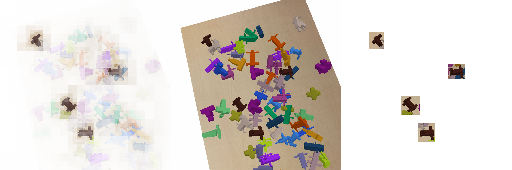

# zero shot yolo

you only look o̶n̶c̶e̶ zero times

zero shot detector that generalises to new objects by including reference images
of the object of interest as part of the model input.

see https://matpalm.com/blog/yolz for a walkthrough




## high level repro

```
sh generate_split_chunk_data.sh
sh v3_train.sh
sh v3_test.sh
```

## models

training is split across two keras models and run using `stateless_call`

### embedding

```
┏━━━━━━━━━━━━━━━━━━━━━━━━━━━━━━━━━━━━━━┳━━━━━━━━━━━━━━━━━━━━━━━━━━━━━┳━━━━━━━━━━━━━━━━━┓
┃ Layer (type)                         ┃ Output Shape                ┃         Param # ┃
┡━━━━━━━━━━━━━━━━━━━━━━━━━━━━━━━━━━━━━━╇━━━━━━━━━━━━━━━━━━━━━━━━━━━━━╇━━━━━━━━━━━━━━━━━┩
│ input_layer (InputLayer)             │ (None, 64, 64, 3)           │               0 │
├──────────────────────────────────────┼─────────────────────────────┼─────────────────┤
│ obj_e_0_conv_m (Conv2D)              │ (None, 32, 32, 16)          │             448 │
├──────────────────────────────────────┼─────────────────────────────┼─────────────────┤
│ obj_e_0_bn_m (BatchNormalization)    │ (None, 32, 32, 16)          │              64 │
├──────────────────────────────────────┼─────────────────────────────┼─────────────────┤
│ obj_e_0_relu_m (Activation)          │ (None, 32, 32, 16)          │               0 │
├──────────────────────────────────────┼─────────────────────────────┼─────────────────┤
│ obj_e_1_conv_m (Conv2D)              │ (None, 16, 16, 32)          │           4,640 │
├──────────────────────────────────────┼─────────────────────────────┼─────────────────┤
│ obj_e_1_bn_m (BatchNormalization)    │ (None, 16, 16, 32)          │             128 │
├──────────────────────────────────────┼─────────────────────────────┼─────────────────┤
│ obj_e_1_relu_m (Activation)          │ (None, 16, 16, 32)          │               0 │
├──────────────────────────────────────┼─────────────────────────────┼─────────────────┤
│ obj_e_2_conv_m (Conv2D)              │ (None, 8, 8, 64)            │          18,496 │
├──────────────────────────────────────┼─────────────────────────────┼─────────────────┤
│ obj_e_2_bn_m (BatchNormalization)    │ (None, 8, 8, 64)            │             256 │
├──────────────────────────────────────┼─────────────────────────────┼─────────────────┤
│ obj_e_2_relu_m (Activation)          │ (None, 8, 8, 64)            │               0 │
├──────────────────────────────────────┼─────────────────────────────┼─────────────────┤
│ obj_e_3_conv_m (Conv2D)              │ (None, 4, 4, 256)           │         147,712 │
├──────────────────────────────────────┼─────────────────────────────┼─────────────────┤
│ obj_e_3_bn_m (BatchNormalization)    │ (None, 4, 4, 256)           │           1,024 │
├──────────────────────────────────────┼─────────────────────────────┼─────────────────┤
│ obj_e_3_relu_m (Activation)          │ (None, 4, 4, 256)           │               0 │
├──────────────────────────────────────┼─────────────────────────────┼─────────────────┤
│ obj_e_gp (GlobalMaxPooling2D)        │ (None, 256)                 │               0 │
├──────────────────────────────────────┼─────────────────────────────┼─────────────────┤
│ obj_embeddings (Dense)               │ (None, 512)                 │         131,072 │
├──────────────────────────────────────┼─────────────────────────────┼─────────────────┤
│ obj_e_l2 (L2Normalisation)           │ (None, 512)                 │               0 │
└──────────────────────────────────────┴─────────────────────────────┴─────────────────┘
 Total params: 303,840 (1.16 MB)
 Trainable params: 303,104 (1.16 MB)
 Non-trainable params: 736 (2.88 KB)
```

trained with contrastive loss

### scene

```
┏━━━━━━━━━━━━━━━━━━━━━━━━━━━━━━━┳━━━━━━━━━━━━━━━━━━━━━━━━━━━┳━━━━━━━━━━━━━━━━━┳━━━━━━━━━━━━━━━━━━━━━━━━━━━━┓
┃ Layer (type)                  ┃ Output Shape              ┃         Param # ┃ Connected to               ┃
┡━━━━━━━━━━━━━━━━━━━━━━━━━━━━━━━╇━━━━━━━━━━━━━━━━━━━━━━━━━━━╇━━━━━━━━━━━━━━━━━╇━━━━━━━━━━━━━━━━━━━━━━━━━━━━┩
│ scene_input (InputLayer)      │ (None, 640, 640, 3)       │               0 │ -                          │
├───────────────────────────────┼───────────────────────────┼─────────────────┼────────────────────────────┤
│ scene_down_0_conv_m (Conv2D)  │ (None, 320, 320, 16)      │             448 │ scene_input[0][0]          │
├───────────────────────────────┼───────────────────────────┼─────────────────┼────────────────────────────┤
│ scene_down_0_bn_m             │ (None, 320, 320, 16)      │              64 │ scene_down_0_conv_m[0][0]  │
│ (BatchNormalization)          │                           │                 │                            │
├───────────────────────────────┼───────────────────────────┼─────────────────┼────────────────────────────┤
│ scene_down_0_relu_m           │ (None, 320, 320, 16)      │               0 │ scene_down_0_bn_m[0][0]    │
│ (Activation)                  │                           │                 │                            │
├───────────────────────────────┼───────────────────────────┼─────────────────┼────────────────────────────┤
│ scene_down_1_conv_m (Conv2D)  │ (None, 160, 160, 32)      │           4,640 │ scene_down_0_relu_m[0][0]  │
├───────────────────────────────┼───────────────────────────┼─────────────────┼────────────────────────────┤
│ scene_down_1_bn_m             │ (None, 160, 160, 32)      │             128 │ scene_down_1_conv_m[0][0]  │
│ (BatchNormalization)          │                           │                 │                            │
├───────────────────────────────┼───────────────────────────┼─────────────────┼────────────────────────────┤
│ scene_down_1_relu_m           │ (None, 160, 160, 32)      │               0 │ scene_down_1_bn_m[0][0]    │
│ (Activation)                  │                           │                 │                            │
├───────────────────────────────┼───────────────────────────┼─────────────────┼────────────────────────────┤
│ scene_down_2_conv_m (Conv2D)  │ (None, 80, 80, 64)        │          18,496 │ scene_down_1_relu_m[0][0]  │
├───────────────────────────────┼───────────────────────────┼─────────────────┼────────────────────────────┤
│ scene_down_2_bn_m             │ (None, 80, 80, 64)        │             256 │ scene_down_2_conv_m[0][0]  │
│ (BatchNormalization)          │                           │                 │                            │
├───────────────────────────────┼───────────────────────────┼─────────────────┼────────────────────────────┤
│ scene_down_2_relu_m           │ (None, 80, 80, 64)        │               0 │ scene_down_2_bn_m[0][0]    │
│ (Activation)                  │                           │                 │                            │
├───────────────────────────────┼───────────────────────────┼─────────────────┼────────────────────────────┤
│ scene_down_3_conv_m (Conv2D)  │ (None, 40, 40, 128)       │          73,856 │ scene_down_2_relu_m[0][0]  │
├───────────────────────────────┼───────────────────────────┼─────────────────┼────────────────────────────┤
│ scene_down_3_bn_m             │ (None, 40, 40, 128)       │             512 │ scene_down_3_conv_m[0][0]  │
│ (BatchNormalization)          │                           │                 │                            │
├───────────────────────────────┼───────────────────────────┼─────────────────┼────────────────────────────┤
│ scene_down_3_relu_m           │ (None, 40, 40, 128)       │               0 │ scene_down_3_bn_m[0][0]    │
│ (Activation)                  │                           │                 │                            │
├───────────────────────────────┼───────────────────────────┼─────────────────┼────────────────────────────┤
│ scene_down_4_conv_m (Conv2D)  │ (None, 20, 20, 256)       │         295,168 │ scene_down_3_relu_m[0][0]  │
├───────────────────────────────┼───────────────────────────┼─────────────────┼────────────────────────────┤
│ scene_down_4_bn_m             │ (None, 20, 20, 256)       │           1,024 │ scene_down_4_conv_m[0][0]  │
│ (BatchNormalization)          │                           │                 │                            │
├───────────────────────────────┼───────────────────────────┼─────────────────┼────────────────────────────┤
│ scene_down_4_relu_m           │ (None, 20, 20, 256)       │               0 │ scene_down_4_bn_m[0][0]    │
│ (Activation)                  │                           │                 │                            │
├───────────────────────────────┼───────────────────────────┼─────────────────┼────────────────────────────┤
│ scene_down_5_conv_m (Conv2D)  │ (None, 10, 10, 256)       │         590,080 │ scene_down_4_relu_m[0][0]  │
├───────────────────────────────┼───────────────────────────┼─────────────────┼────────────────────────────┤
│ scene_down_5_bn_m             │ (None, 10, 10, 256)       │           1,024 │ scene_down_5_conv_m[0][0]  │
│ (BatchNormalization)          │                           │                 │                            │
├───────────────────────────────┼───────────────────────────┼─────────────────┼────────────────────────────┤
│ scene_down_5_relu_m           │ (None, 10, 10, 256)       │               0 │ scene_down_5_bn_m[0][0]    │
│ (Activation)                  │                           │                 │                            │
├───────────────────────────────┼───────────────────────────┼─────────────────┼────────────────────────────┤
│ obj_embedding_inp             │ (None, 512)               │               0 │ -                          │
│ (InputLayer)                  │                           │                 │                            │
├───────────────────────────────┼───────────────────────────┼─────────────────┼────────────────────────────┤
│ scene_features (Dense)        │ (None, 10, 10, 512)       │         131,072 │ scene_down_5_relu_m[0][0]  │
├───────────────────────────────┼───────────────────────────┼─────────────────┼────────────────────────────┤
│ broadcast_e (Broadcast)       │ (None, 10, 10, 512)       │               0 │ obj_embedding_inp[0][0]    │
├───────────────────────────────┼───────────────────────────┼─────────────────┼────────────────────────────┤
│ add (Add)                     │ (None, 10, 10, 512)       │               0 │ scene_features[0][0],      │
│                               │                           │                 │ broadcast_e[0][0]          │
├───────────────────────────────┼───────────────────────────┼─────────────────┼────────────────────────────┤
│ up_sampling2d (UpSampling2D)  │ (None, 20, 20, 512)       │               0 │ add[0][0]                  │
├───────────────────────────────┼───────────────────────────┼─────────────────┼────────────────────────────┤
│ scene_up_0_conv_m (Conv2D)    │ (None, 20, 20, 256)       │         131,328 │ up_sampling2d[0][0]        │
├───────────────────────────────┼───────────────────────────┼─────────────────┼────────────────────────────┤
│ scene_up_0_bn_m               │ (None, 20, 20, 256)       │           1,024 │ scene_up_0_conv_m[0][0]    │
│ (BatchNormalization)          │                           │                 │                            │
├───────────────────────────────┼───────────────────────────┼─────────────────┼────────────────────────────┤
│ scene_up_0_relu_m             │ (None, 20, 20, 256)       │               0 │ scene_up_0_bn_m[0][0]      │
│ (Activation)                  │                           │                 │                            │
├───────────────────────────────┼───────────────────────────┼─────────────────┼────────────────────────────┤
│ add_1 (Add)                   │ (None, 20, 20, 256)       │               0 │ scene_up_0_relu_m[0][0],   │
│                               │                           │                 │ scene_down_4_relu_m[0][0]  │
├───────────────────────────────┼───────────────────────────┼─────────────────┼────────────────────────────┤
│ up_sampling2d_1               │ (None, 40, 40, 256)       │               0 │ add_1[0][0]                │
│ (UpSampling2D)                │                           │                 │                            │
├───────────────────────────────┼───────────────────────────┼─────────────────┼────────────────────────────┤
│ scene_up_1_conv_m (Conv2D)    │ (None, 40, 40, 128)       │          32,896 │ up_sampling2d_1[0][0]      │
├───────────────────────────────┼───────────────────────────┼─────────────────┼────────────────────────────┤
│ scene_up_1_bn_m               │ (None, 40, 40, 128)       │             512 │ scene_up_1_conv_m[0][0]    │
│ (BatchNormalization)          │                           │                 │                            │
├───────────────────────────────┼───────────────────────────┼─────────────────┼────────────────────────────┤
│ scene_up_1_relu_m             │ (None, 40, 40, 128)       │               0 │ scene_up_1_bn_m[0][0]      │
│ (Activation)                  │                           │                 │                            │
├───────────────────────────────┼───────────────────────────┼─────────────────┼────────────────────────────┤
│ add_2 (Add)                   │ (None, 40, 40, 128)       │               0 │ scene_up_1_relu_m[0][0],   │
│                               │                           │                 │ scene_down_3_relu_m[0][0]  │
├───────────────────────────────┼───────────────────────────┼─────────────────┼────────────────────────────┤
│ up_sampling2d_2               │ (None, 80, 80, 128)       │               0 │ add_2[0][0]                │
│ (UpSampling2D)                │                           │                 │                            │
├───────────────────────────────┼───────────────────────────┼─────────────────┼────────────────────────────┤
│ scene_up_2_conv_m (Conv2D)    │ (None, 80, 80, 64)        │           8,256 │ up_sampling2d_2[0][0]      │
├───────────────────────────────┼───────────────────────────┼─────────────────┼────────────────────────────┤
│ scene_up_2_bn_m               │ (None, 80, 80, 64)        │             256 │ scene_up_2_conv_m[0][0]    │
│ (BatchNormalization)          │                           │                 │                            │
├───────────────────────────────┼───────────────────────────┼─────────────────┼────────────────────────────┤
│ scene_up_2_relu_m             │ (None, 80, 80, 64)        │               0 │ scene_up_2_bn_m[0][0]      │
│ (Activation)                  │                           │                 │                            │
├───────────────────────────────┼───────────────────────────┼─────────────────┼────────────────────────────┤
│ add_3 (Add)                   │ (None, 80, 80, 64)        │               0 │ scene_up_2_relu_m[0][0],   │
│                               │                           │                 │ scene_down_2_relu_m[0][0]  │
├───────────────────────────────┼───────────────────────────┼─────────────────┼────────────────────────────┤
│ classifier_0_conv_m (Conv2D)  │ (None, 80, 80, 256)       │          16,640 │ add_3[0][0]                │
├───────────────────────────────┼───────────────────────────┼─────────────────┼────────────────────────────┤
│ classifier_0_bn_m             │ (None, 80, 80, 256)       │           1,024 │ classifier_0_conv_m[0][0]  │
│ (BatchNormalization)          │                           │                 │                            │
├───────────────────────────────┼───────────────────────────┼─────────────────┼────────────────────────────┤
│ classifier_0_relu_m           │ (None, 80, 80, 256)       │               0 │ classifier_0_bn_m[0][0]    │
│ (Activation)                  │                           │                 │                            │
├───────────────────────────────┼───────────────────────────┼─────────────────┼────────────────────────────┤
│ classifier_1_conv_m (Conv2D)  │ (None, 80, 80, 128)       │          32,896 │ classifier_0_relu_m[0][0]  │
├───────────────────────────────┼───────────────────────────┼─────────────────┼────────────────────────────┤
│ classifier_1_bn_m             │ (None, 80, 80, 128)       │             512 │ classifier_1_conv_m[0][0]  │
│ (BatchNormalization)          │                           │                 │                            │
├───────────────────────────────┼───────────────────────────┼─────────────────┼────────────────────────────┤
│ classifier_1_relu_m           │ (None, 80, 80, 128)       │               0 │ classifier_1_bn_m[0][0]    │
│ (Activation)                  │                           │                 │                            │
├───────────────────────────────┼───────────────────────────┼─────────────────┼────────────────────────────┤
│ classifier (Dense)            │ (None, 80, 80, 1)         │             129 │ classifier_1_relu_m[0][0]  │
└───────────────────────────────┴───────────────────────────┴─────────────────┴────────────────────────────┘
 Total params: 1,342,241 (5.12 MB)
 Trainable params: 1,339,073 (5.11 MB)
 Non-trainable params: 3,168 (12.38 KB)

```

trained with (binary) focal loss